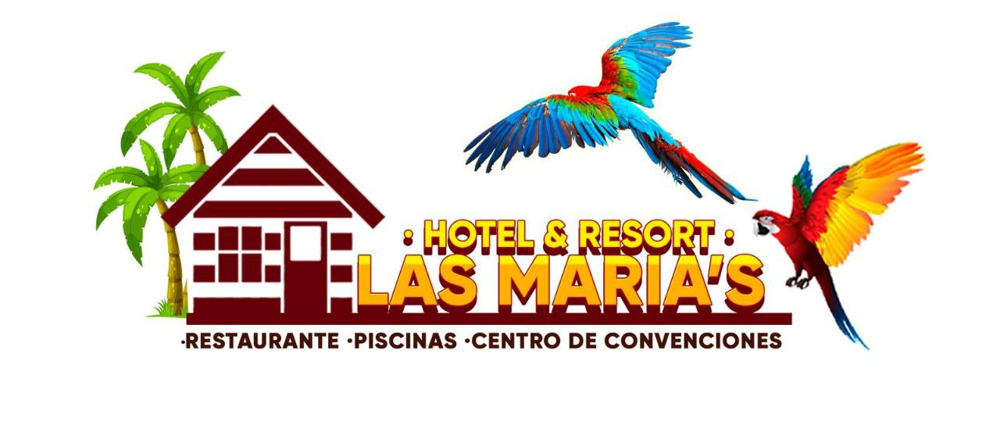

# Las Maria's Management Control systems

This repository contains **Las Maria's Hotel & Resort** management systems it currently contains the definition of all projects that are part of this managemente system.

## Which systems are included

We include all systems that are and will be implemented or are in some part of the implementation process. This does not means that design would not change over time but this is the basic idea of what is available and which systems we intentend to develop in the future.

Systems are:

- **Hub**: Is used as a centralized authentication and permission validation system that ``does not`` only authenticate users, also includes some information about the users/clients that will be share over the different subsystems so clients stay could be more personal and ease.
- **PoS**: Point Of Sale, as simple system that handles the different point of sales, it includes orders that are send to the kitchen and keep a track of clients orders.
- **Pools**: ``YET TO BE DEFINED``
- **Hotel**: ``YET TO BE DEFINED``
- **Restaurant**: ``YET TO BE DEFINED``
- **Web**: A centralized web client that consumes the different data provided by the systems, it has been developed using **ReactJs**.

## Used technologies

Because of the level of professionality required by this systems the better choice was to used ``.Net6`` for the backend/APIs and ``ReactJS`` for the frontend application. Both with a heavy production stability. In all cases Integration and Unitary tests are included to avoid posible errors.

## System design and architecture

We decide to use a microservice oriented architecture, this allows to split general software into small pieces and make a better use of existing resources. And also provide an extra layer of stability in system performance, because a service that fails will "not" directly affect to another and maintainance in one service will not require to stop the entire system.

Also some points are set, like define interfaces to shared data structures and many others that make easier the information exchange.

We make a heavy use of the **Orun Building Blocks** packages, which include a wide range of helper classes, extensions and design patterns that are used in the system for easier development.

## Developers and Authors

Well we are humans and we all want that in some way our work been recognize by other so here we go:

* **Michel Perez**: Architect, DB design, Graphic design, developer, all-in-one kind of guy.
* **Adrian Canova**: Server administrator, DevOp, Deployer black and white screen hacker.
* **Alexander Pantaleon**: Graphic designer and public relation dude.

## License

> MIT License
>
> Copyright (c) 2022. Las Maria's Hotel & Resort.
>
> Copyright (c) 2021-2022. Orun Innovations LLC and Contributors.
> 
> Permission is hereby granted, free of charge, to any person obtaining a copy
> of this software and associated documentation files (the "Software"), to deal
> in the Software without restriction, including without limitation the rights
> to use, copy, modify, merge, publish, distribute, sublicense, and/or sell
> copies of the Software, and to permit persons to whom the Software is
> furnished to do so, subject to the following conditions:
>
> The above copyright notice and this permission notice shall be included in all
> copies or substantial portions of the Software.
>
> THE SOFTWARE IS PROVIDED "AS IS", WITHOUT WARRANTY OF ANY KIND, EXPRESS OR
> IMPLIED, INCLUDING BUT NOT LIMITED TO THE WARRANTIES OF MERCHANTABILITY,
> FITNESS FOR A PARTICULAR PURPOSE AND NONINFRINGEMENT. IN NO EVENT SHALL THE
> AUTHORS OR COPYRIGHT HOLDERS BE LIABLE FOR ANY CLAIM, DAMAGES OR OTHER
> LIABILITY, WHETHER IN AN ACTION OF CONTRACT, TORT OR OTHERWISE, ARISING FROM,
> OUT OF OR IN CONNECTION WITH THE SOFTWARE OR THE USE OR OTHER DEALINGS IN THE
> SOFTWARE.
>
